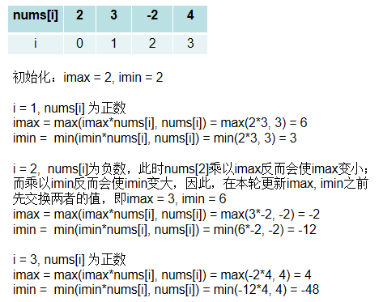

#### [152. Maximum Product Subarray](https://leetcode-cn.com/problems/maximum-product-subarray/)

给你一个整数数组 `nums` ，请你找出数组中乘积最大的连续子数组（该子数组中至少包含一个数字）。

```
输入: [2,3,-2,4]
输出: 6
解释: 子数组 [2,3] 有最大乘积 6。

输入: [-2,0,-1]
输出: 0
解释: 结果不能为 2, 因为 [-2,-1] 不是子数组。
```

分析：

本题是[第53题](./0053Maximum_Subarray.md) 题的延伸，不同的是，这里求的是最大的**乘积**。对于乘法，如果一个很大的正数乘以一个负数，就会变成一个很小的数；一个很小的负数乘以负数，就会变成很大的数。因此，在遍历的过程中，我们需要记录两个状态值。

**令`imax`表示以`nums[i]`为结尾的子数组的最大乘积，`imin`表示以`nums[i]`为结尾的子数组的最小乘积**，初始化`imax = nums[0], imin = nums[0]`。 那么在遍历的过程中，就要根据当前位置的正负值，来更新`imax`和`imin`。 到底该怎么更新呢？以[2,3,-2,4]为例进行说明：



由于最终的结果可能发生在以任何位置 i 为结尾的子数组中，因此需要跟踪每一个imax的值来更新最终结果res。最终的代码如下：

```java
// 时间复杂度：O(n)
// 空间复杂度：O(1)
class Solution {
    public int maxProduct(int[] nums) {
        int res = nums[0];
        int imax = 1, imin = 1;
        for(int i = 0; i < nums.length; i++) {
            if(nums[i] < 0) {
                int tmp = imax;
                imax = imin;
                imin = tmp;
            }
            imax = Math.max(nums[i] * imax, nums[i]);
            imin = Math.min(nums[i] * imin, nums[i]);
            res = Math.max(res, imax);
        }
        return res;
    }
}
```


