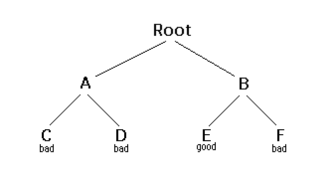

# 回溯思想

## 1.如何理解回溯
回溯是递归的一种形式。通常的场景是：你会面临很多的选择，你必须选择其中之一，然后根据这个选择，接着你又会面临着新的选择。这个过程不断重复直到达到某个最终状态。如果这个“最终状态”是符合某种要求的，我们称其为好的状态，反之则不是。

我们可以把回溯抽象成一棵树，处理过程起始于根节点，而叶节点就是某个处理过程的最终状态。当然，叶节点有好有坏，好的叶节点就是符合要求的最终状态（为了方便说明，我们记符合要求的叶节点为`goal-leaf`），坏的叶节点就是不符合要求的。假设，某次处理结果的最终状态是不符合要求的，那么，就回溯（backtrack）到其父节点，**选择父节点的其他尚未访问过的孩子节点进行处理**。下面我们以最简单的二叉树为例进行说明。



1. Starting at Root, your options are A and B. You choose A.
2. At A, your options are C and D. You choose C.
3. C is bad. Go back to A.
4. At A, you have already tried C, and it failed. Try D.
5. D is bad. Go back to A.
6. At A, you have no options left to try. Go back to Root.
7. At Root, you have already tried A. Try B.
8. At B, your options are E and F. Try E.
9. E is good. Congratulations!

借助 tree 这个数据结构当然便于理解，但注意，事实上这里的 "tree" 更多表示的是一种**抽象模型**，**仅仅用树的分支来表示处理过程中遇到的选择，用叶节点表示最终状态**，而不单单指的是数据结构中所熟悉的那个 "tree"。如果是数据结构中的那个 tree，那么回溯算法（*backtracking* ）就等价于所谓的深度优先遍历（*depth-first searching*）。因此，**回溯**和**深度优先遍历**本质上是一致的，只不过回溯用于处理抽象的模型，而深度优先遍历是基于树/图这些具体的数据结构产生的一种算法。

下面给出了回溯算法的一个通用模板。

```java
boolean solve(Node n) {
    if n is a leaf node {
        if the leaf is a goal node, return true
        else return false
    } else {
        for each child c of n {
            if solve(c) succeeds, return true
        }
        return false
    }
}
```
注意，该算法的返回值是一个布尔类型。如果`solve(n)`为true，表示节点n是从`root`到`goal-leaf`中的一部分，我们称其节点n是有解的(solvable)；如果`solve(n)`为false，则表示经过节点n找不到一条通往`goal-leaf`的路径，我们称该节点是无解的(unsolvable)。

检验一个节点是否有解的原则如下：

- If any child of n is solvable, then n is solvable.(对于父节点n，其**任意**一个孩子节点是有解的，则意味着节点n有解)

- If no child of n is solvable, then n is not solvable.(对于父节点n，其**所有**孩子节点都是无解的，则说明着节点n无解)

因此，当要判断非叶节点n是否有解时，只要检测它的孩子节点是否有解（至少有一个成立即可），如此递归的进行。在上面的代码中，相关涉及的是以下这部分代码。

```java
 for each child c of n {
    // 对于节点n而言，只要有一个孩子节点存在通路，则n就是通的
 	if solve(c) succeeds, return true
 }
 // 如果n的所有孩子节点都不存在通路，说明经由n并可行
 return false
```
最终，递归会在叶节点结束，即，叶节点是递归边界。如果叶节点是符合要求的（或者说根节点到叶节点这条路径是符合要求的），则称该叶节点为`goal-node`，即说明它是有解的；反之则不是，在上面的代码中，相关涉及的是以下部分。

```java
if n is a leaf node {
    if the leaf is a goal node, return true
    else return false
}
```

总的来说，搜索一棵树的处理步骤如下：

1. If the tree consists of a single leaf, test whether it is a goal node,
2. Otherwise, search the subtrees until you find one containing a goal node, or until you have searched them all unsuccessfully.


## 2.回溯问题

一般来说，回溯问题一般分为3种类型：

- case 1：Find a path to success（有没有解）

- case 2：Find all paths to success（求所有解）

  - 求所有解的个数
  - 求每个解的具体的信息（比如，打印路径信息等）

- case 3：Find the best path to success（求最优解）

关于回溯的三种问题，模板略有不同，

第一种，返回值是`true/false`。

第二种，求个数，设全局计数器count，返回值是void；求所有解信息，设result，返回值void。

第三种，设个全局变量best，返回值是void。

简单的模板如下：

### Case 1：Find a path to success（有没有解）

```java
boolean solve(Node n) {
    if n is a leaf node {
        if the leaf is a goal node, return true
        else return false
    } else {
        for each child c of n {
            if solve(c) succeeds, return true
        }
        return false
    }
}
```

### Case 2：Find all paths to success（求所有解）

```java
void solve(Node n) {
    if n is a leaf node {
        // 设置count为全局变量 
        if the leaf is a goal node {
           count++;
           return;
        } else {
           return
        }
    } else {
        for each child c of n {
            solve(c)
        }
    }
}
```

### Case 3：Find the best path to success（求最优解）

```java
void solve(Node n) {
    if n is a leaf node {
        if the leaf is a goal node {
            update best result;
            return;
        }else {
            return;
        }
    } else {
        for each child c of n {
            solve(c)
        }
    }
}
```
---
参考文献：
* 原文地址：https://www.cis.upenn.edu/~matuszek/cit594-2012/Pages/backtracking.html
* 参考：https://segmentfault.com/a/1190000006121957
